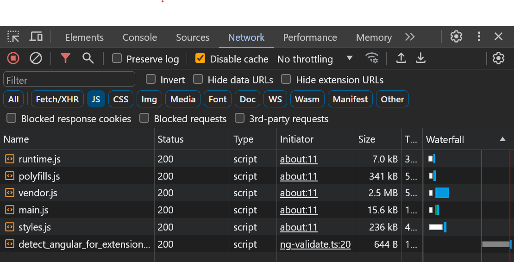
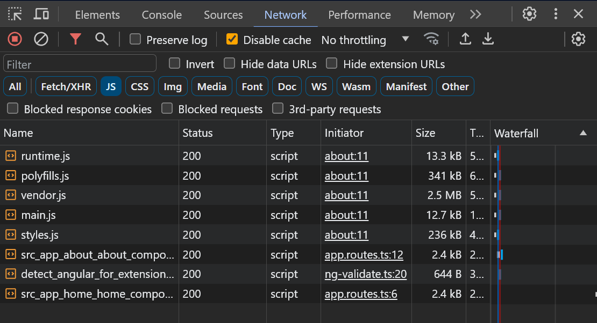

## Creating the components

We will now create two route components in Angular. And they will be [Standalone Components](https://angular.io/guide/standalone-components). The Angular CLI is great to create components and other entities for the application. Run the following command from your terminal.

```bash
ng g c home
ng g c about
```

This generates a new standalone components named `home` and `about` inside the `src/app/home` and `src/app/about` folders, respectively for us.

## Setting up routes

Now let's create routes for these components. We want to show the `HomeComponent` on the `/home` route of our application. And we also want to make it (`/home`) the default route.

Let's open the `app.routes.ts` file to add some code as follows:

```ts
import { Routes } from '@angular/router';
import { HomeComponent } from './home/home.component';

export const routes: Routes = [{
  path: 'home',
  component: HomeComponent,
}, {
  path: '',
  pathMatch: 'full',
  redirectTo: 'home'
}];
```

Let's add the `AboutComponent` as well, as follows:

```ts
import { Routes } from '@angular/router';
import { HomeComponent } from './home/home.component';
import { AboutComponent } from './about/about.component';

export const routes: Routes = [{
  path: 'home',
  component: HomeComponent
}, {
  path: 'about',
  component: AboutComponent
}, {
  path: '',
  pathMatch: 'full',
  redirectTo: 'home'
}];

```
:::note
If you refresh the app at [http://localhost:4200](http://localhost:4200), you should see the text that says `home works` and the URL should also be automatically redirected to `http://localhost:4200/home` even if you try to go to `http://localhost:4200`.
:::

## Creating a header component with navigation

Creat a new component using the Angular CLI as follows:

```bash
ng g c components/header
```
> Notice that even if the `components` folder does not exist at the moment, Angular CLI creates it automatically.

Now let's use the Header component inside our App component. We have to first import the Header component in the App component. Let's modify the `src/app/app.component.ts` file as follows:


```ts
import { Component } from '@angular/core';
import { CommonModule } from '@angular/common';
import { RouterOutlet } from '@angular/router';
import { HeaderComponent } from './components/header/header.component'; /* 👈🏽 add this */

@Component({
  selector: 'app-root',
  standalone: true,
  imports: [CommonModule, RouterOutlet, HeaderComponent /* 👈🏽 add this */],
  templateUrl: './app.component.html',
  styleUrls: ['./app.component.scss']
})
export class AppComponent {
  title = 'ng-flight-scanner';
}
```

Now let's use the header component using its selector `<app-header>` inside the `app.component.html` file as follows:

```html
<app-header></app-header> <!-- 👈🏽 add this -->
<main class="flex-1 w-full bg-gray-100 dark:bg-slate-900 text-slate-900 dark:text-white mx-auto max-w-screen-xl px-4 py-4 gap-8 flex-col md:flex-row sm:px-6 lg:px-8">
  <router-outlet></router-outlet>
</main>
```


At this point, the view in your browser should say:
```
header works!
home works!
```

Now, update the contents of the Header Component as follows: `src/app/components/header/header.component.html` as follows:

import { Tabs, TabItem } from '@astrojs/starlight/components';


<Tabs>
	<TabItem label="header.component.html">
  ```html
    <header class="bg-gray-50 dark:bg-slate-800">
    <div class="mx-auto max-w-screen-xl px-4 py-4 gap-8 flex-col md:flex-row sm:px-6 lg:px-8 flex items-center justify-between">

      <div>
        <h1 class="text-2xl font-bold text-gray-900 dark:text-white sm:text-3xl">
          Welcome to Flight Scanner!
        </h1>

        <p class="mt-1.5 text-sm text-gray-500 dark:text-gray-300">
          Are you ready to go to your next destination? 🚀
        </p>
      </div>
      <div class="flex items-center justify-end gap-4 flex-1">
        <div class="flex items-center gap-4 flex-1">
          <div class="relative flex-1">
            <label class="sr-only" for="search"> Search </label>

            <input
              class="h-10 w-full rounded-full border-none bg-white pe-10 ps-4 text-sm shadow-sm flex-1"
              id="search"
              type="search"
              placeholder="Search flights..."
            />

            <button
              type="button"
              class="absolute end-1 top-1/2 -translate-y-1/2 rounded-full bg-gray-50 p-2 text-gray-600 transition hover:text-gray-700"
            >
              <span class="sr-only">Search</span>
              <svg
                xmlns="http://www.w3.org/2000/svg"
                class="h-4 w-4"
                fill="none"
                viewBox="0 0 24 24"
                stroke="currentColor"
                stroke-width="2"
              >
                <path
                  stroke-linecap="round"
                  stroke-linejoin="round"
                  d="M21 21l-6-6m2-5a7 7 0 11-14 0 7 7 0 0114 0z"
                />
              </svg>
            </button>
          </div>


        </div>

        <span
          aria-hidden="true"
          class="block h-6 w-px rounded-full bg-gray-200"
        ></span>

        <div class="flex gap-4 items-center text-slate-900 dark:text-white">
          <a class="hover:underline hover:underline-offset-4 hover:text-slate-600 dark:hover:text-slate-500" routerLink="/home">Home</a>
          <a class="hover:underline hover:underline-offset-4 hover:text-slate-600 dark:hover:text-slate-500" routerLink="/about">About</a>
        </div>
      </div>
    </div>
  </header>
  ```
  </TabItem>
	<TabItem label="header.component.ts">
  ```ts
  import { Component } from '@angular/core';
  import { CommonModule } from '@angular/common';
  import { RouterModule } from '@angular/router'; /* 👈🏽 add this */

  @Component({
    selector: 'app-header',
    standalone: true,
    imports: [CommonModule, RouterModule /* 👈🏽 add this */],
    templateUrl: './header.component.html',
    styleUrls: ['./header.component.scss']
  })
  export class HeaderComponent {

  }
  ```
  </TabItem>
</Tabs>

:::note
Notice that we are using the `routerLink` directive to create navigation links in the header. 
If we don't add RouterModule to the `HeaderComponent` class's imports, the `routerLink` directive won't work.
:::

## Optimizing performance & reducing bundle size with lazily-loaded routes

Open the browser's debugger, go to the network tab, and filter by `JS` files.
You'll notice that we have a `main.js` file which is about `16kb` as shown in Figure 1.1. 


<p style="width: 100%; text-align: center">Figure 1.1 - All components bundled in `main.js`</p>

If you click that file you can see the contents containing both `HomeComponent` and the `AboutComponent` classes. Which means all our components are inside the `main.js` bundle.

Let's make both the routes lazy. I.e. we will load them lazily when the user actually goes to the route.
Update the `app.routes.ts` file as follows:


```ts
import { Routes } from '@angular/router';

// Notice that we've removed the HomeComponent and AboutComponent imports

export const routes: Routes = [{
  path: 'home',
  loadComponent: async () => {
    const mod = await import('./home/home.component');
    return mod.HomeComponent;
  }
}, {
  path: 'about',
  loadComponent: async () => {
    const mod = await import('./about/about.component');
    return mod.AboutComponent;
  }
}, {
  path: '',
  pathMatch: 'full',
  redirectTo: 'home'
}];
```

Now, if you look at the network tab again, you should be able to see separate JS bundles being downloaded for both the routes as shown in Figure 1.2.


<p style="width: 100%; text-align: center">Figure 1.2 - Lazily loading Home and About routes</p>

<br/>
Awesome! 🚀 You now know how to implement lazily loaded routes in Angular 👏🏽